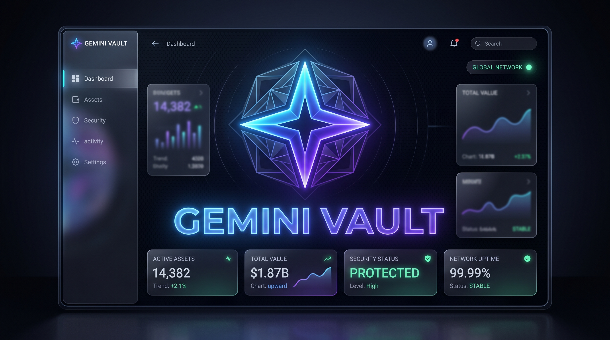

<p align="center">
  
</p>

# Gemini Vault

> Full local backup and offline viewer for your AI chats (Gemini, ChatGPT, Claude).


Keep all your AI conversations on your own machine, search them in milliseconds,
read them offline (with LaTeX, code highlighting and Canvas), and export them
anywhere. **All data is processed 100% locally — nothing is sent to any server.**

There are **two ways** to use Gemini Vault. Pick the one you want — the first
needs nothing but Python:

| | Mode | What you get | What you need |
|---|---|---|---|
| 🟢 | **[Basic](#-basic-mode--just-read--search)** | Fast local archive: read, full-text search, dashboard, export | Just Python. **No AI, no downloads, no keys.** |
| 🧠 | **[Advanced](#-advanced-mode--smart-librarian-with-local-ai)** | Everything above **+** AI auto-tags, summaries and "ask the archive" | Adds a free local model (Ollama) |

---

## 🟢 Basic mode — just read & search

This is all most people need: a quick, private, offline archive of your chats.

> **No neural networks. No model downloads. No API keys. No GPU. No internet.**
> The Basic mode is the whole app running on your machine with nothing but the
> Python standard library.

### Start it

**Windows — the easy way:** double-click **`start.bat`** (or `Open Gemini Vault.bat`).
It starts the viewer and opens it in your browser.

**Any OS — from a terminal:**

```bash
cd Gemini_Vault
python viewer/serve.py
```

Then open <http://127.0.0.1:8642> (it opens automatically). That's it.

### Put your own chats in

Import an export once, then start the viewer. The format is auto-detected.

```bash
# Google Takeout (a .zip, no need to unzip it)
python processor/import_takeout.py path/to/takeout-001.zip

# …or a Gemini / ChatGPT / Claude export (a .json)
python processor/parse_and_index.py path/to/conversations.json

python viewer/serve.py
```

ChatGPT chats land under the account **`ChatGPT`**, Claude under **`Claude`**, so
you can filter by source. Re-importing a newer export only adds what changed
(SHA256 deduplication) — it never duplicates chats.

### What you can do in Basic mode

- 🔎 **Full-text search** across every chat (SQLite FTS5, Unicode-aware)
- 🖥 **Offline reading** with LaTeX (KaTeX), code highlighting and Canvas
- 📊 **Dashboard**: activity by month, by account, document types, top chats
- 🔀 **Filter & sort** by account, year, Canvas, length or title
- ⤓ **Export** one chat (`.md` / HTML / print→PDF) or the whole vault
  (`.md` / ZIP / portable JSON archive)
- 👥 **Multiple accounts** and **multiple sources** in one database
- 🌐 **Bilingual UI** (English ⇄ Russian), one-click toggle

---

## 🧠 Advanced mode — Smart Librarian with local AI

The **Smart Librarian** adds AI on top of the archive:

- 🏷 **Auto-tags** every chat with a few topical tags
- 📝 Writes a short **summary** for each chat
- 💬 **"Ask the archive"** — ask a question in plain language and get an answer
  with citations to the chats it used

> **Everything runs locally and privately on your own machine.** The model is a
> free, open-weight LLM served by **[Ollama](https://ollama.com)** on `localhost`.
> Your chats are **never** sent to the cloud or to any company — they only go from
> one local process to another. If Ollama isn't running, the rest of the app keeps
> working exactly as in Basic mode (you just won't see AI tags).

**Recommended:** a machine with a decent GPU (8 GB+ VRAM) for snappy answers.
It also works on CPU — just slower (the first answer after a pause can take a
minute while the model loads into memory).

### Step 1 — Install Ollama

Download and install it for your OS from <https://ollama.com/download>.
After installing, Ollama runs a local server at `http://localhost:11434`.

> Check it's up: open <http://localhost:11434> in a browser — it should say
> *"Ollama is running"*. If not, start it (`ollama serve`, or launch the app).

### Step 2 — Download the model

Once, in a terminal (~3.3 GB download):

```bash
ollama pull gemma3:4b
```

`gemma3:4b` is a small, fast, multilingual Google Gemma model — a good default
for tagging and search. You can use any Ollama model (see Step 4).

### Step 3 — Run the Librarian

With Ollama running and the model pulled, tag and summarize your whole archive:

```bash
python processor/librarian.py
```

It's **idempotent**: already-processed chats are skipped, so it never repeats
work and is safe to stop and resume. Options:

```bash
python processor/librarian.py --tag             # tags only
python processor/librarian.py --summarize --limit 50
```

You can also start it from the viewer (a background job with live progress).

### Step 4 — Use it

Open the viewer (`python viewer/serve.py`). You'll now see **tag chips** and an
**AI summary** on each chat, a **tag filter** in the sidebar, and the
**Ask the archive** bar at the top.

**Defaults need no config** — Gemini Vault ships pointed at Ollama + `gemma3:4b`
out of the box. To use a different model or provider, create
**`librarian_config.json`** in the project root (gitignored, so it never reaches
the repo):

```json
{
  "base_url": "http://localhost:11434/v1",
  "api_key": "ollama",
  "model": "gemma3:4b"
}
```

`base_url` is any **OpenAI-compatible** endpoint, so you *can* point this at a
cloud provider instead — but then your chats are sent to that provider. The
local Ollama default keeps everything on your machine. The core stays
zero-dependency: the client is plain `urllib`, no `openai` package needed.

---

## Importing from the browser (optional)

If you can't use Takeout, you can scrape your live chats with Playwright:

```bash
pip install -r requirements.txt
playwright install chromium
python processor/scrape_gemini_url.py --list-all --account you@gmail.com
```

On Windows, `Open Gemini Vault.bat` → **[2] Set up / update the live scraper**
installs these for you. There are also browser extractor scripts in `extractor/`.

## Moving to another machine or account

Click **⤓ Export → 📦 JSON archive (transfer)**, then import the file elsewhere
with `python processor/parse_and_index.py archive.json`. All chats, messages,
Canvas artifacts and dates carry over 1-to-1.

## Project structure

```
Gemini_Vault/
├── start.bat               One-click launcher (Windows)
├── processor/
│   ├── parse_and_index.py   JSON  -> SQLite + FTS5 (SHA256 dedup)
│   ├── import_takeout.py    Takeout ZIP -> SQLite
│   ├── llm_gateway.py       LLM gateway: provider config + DI seam (Ollama default)
│   ├── llm_client.py        OpenAI-compatible transport (stdlib urllib)
│   └── librarian.py         Smart Librarian: auto-tag / summarize
├── viewer/
│   ├── index.html           Single-page viewer
│   └── serve.py             HTTP server + JSON API
├── Source_Accounts/         Your JSON dumps (+ demo_export.json)
└── gemini_vault.db          SQLite (created on first import; gitignored)
```

## Privacy & disclaimer

- **Basic mode is 100% offline.** Nothing ever leaves your machine.
- **Advanced mode (Ollama) is also fully local** — chats go only to the model
  running on your own computer. If you instead point `librarian_config.json` at a
  cloud endpoint, chats are sent to that provider; that choice is yours.
- The database, logs and personal dumps are excluded from git via `.gitignore`.
- The viewer is built for **trusted, self-owned data**: rendered Markdown is not
  sanitized. Don't open someone else's archives with it.

This tool is provided **as-is, with no warranty** (MIT [LICENSE](LICENSE)). Your
exported files contain **your private conversations** — where you store, back up
or share them is **your responsibility**. See the full [DISCLAIMER](DISCLAIMER.md).

## Credits

- **Local AI engine (optional):** the Smart Librarian runs on
  **[Ollama](https://ollama.com)** with Google's open-weight **Gemma** models.
  Gemini Vault talks to Ollama's OpenAI-compatible endpoint over plain HTTP and
  bundles nothing.

## License

MIT — see [LICENSE](LICENSE).
